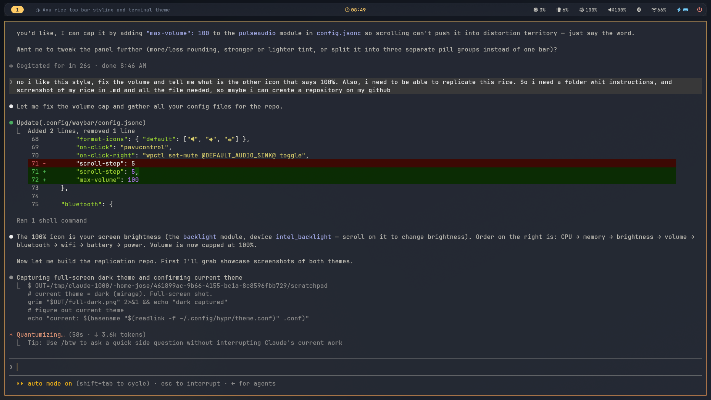
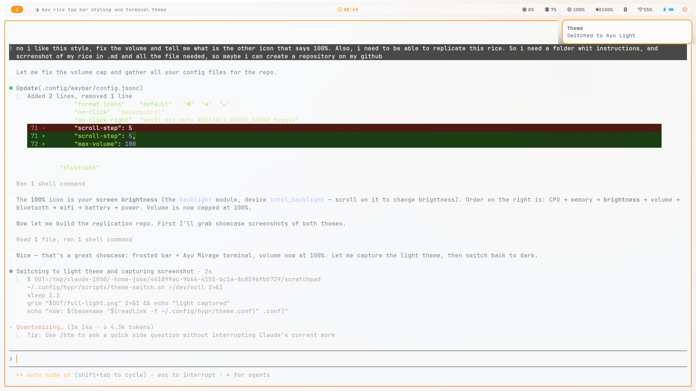
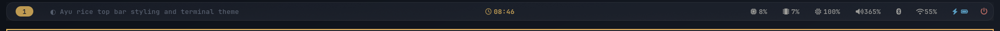

# Ayu Rice — Hyprland

A clean, minimal [Hyprland](https://hypr.land) setup themed with the **Ayu**
palette, with a one-key toggle between **Ayu Mirage** (dark) and **Ayu Light**.
Waybar, rofi, mako, wlogout and kitty all switch together.

> Built on Ubuntu 26.04 "resolute" on a ThinkPad T14 (Intel UHD, 1920×1080).
> Everything is from `apt` except the Nerd Font.

## Screenshots

**Ayu Mirage (dark)**



**Ayu Light**



**The bar** — a frosted, rounded floating panel (Hyprland blur + a translucent tint)



## Features

- **One-key theme switch** — `Super+Shift+T` flips Mirage ⇄ Light across
  Hyprland, Waybar, rofi, mako, kitty and the wallpaper at once.
- **Frosted floating Waybar** — rounded translucent panel that the Hyprland
  blur layerrule turns into frosted glass; native modules only (no tray clutter).
- **Themed terminal** — kitty follows the active theme and live-reloads.
- Square window corners, no shadows, accent active-border gradient.
- rofi launcher, mako notifications, hyprlock + hypridle, wlogout power menu,
  cliphist clipboard history — all Ayu-themed.

## Dependencies

All from Ubuntu's repos:

```bash
sudo apt install hyprland waybar rofi mako-notifier hyprpaper hyprlock \
  hypridle hyprpolkitagent wlogout grim slurp cliphist kitty \
  brightnessctl playerctl pavucontrol wl-clipboard
```

Plus a **Nerd Font** for the bar/terminal glyphs (not in apt):

```bash
mkdir -p ~/.local/share/fonts/JetBrainsMonoNerd && cd ~/.local/share/fonts/JetBrainsMonoNerd
curl -fLO https://github.com/ryanoasis/nerd-fonts/releases/latest/download/JetBrainsMono.zip
unzip -o JetBrainsMono.zip && fc-cache -f
```

## Install

```bash
git clone https://github.com/<you>/ayu-rice.git
cd ayu-rice
./install.sh
```

The installer copies `./.config/*` into `~/.config/`, **backing up** anything
already there to `*.bak-<timestamp>`. Then log into a Hyprland session (default
theme is Ayu Mirage). It never runs `apt` or `sudo` — install packages/fonts yourself (above).

## Adjust for your hardware

These are set for the original machine — edit as needed:

| Setting | File | Default |
|---|---|---|
| Monitor / scale | `hypr/hyprland.conf` | `monitor = ,preferred,auto,1` |
| Keyboard layout | `hypr/hyprland.conf` | `kb_layout = it` (Italian) |
| Backlight device | `waybar/config.jsonc` → `backlight` | `intel_backlight` |
| Default apps | `hypr/hyprland.conf` | kitty / rofi / nautilus / brave |

After editing `hyprland.conf`, apply with `hyprctl reload` (no logout needed);
check with `hyprctl configerrors`.

## How theme switching works

Each component reads an **active symlink** that points at a `*-mirage` / `*-light`
variant. `~/.config/hypr/scripts/theme-switch.sh` (bound to `Super+Shift+T`)
relinks them all, swaps the wallpaper, and live-reloads each app:

| Component | Active link | Variants |
|---|---|---|
| Hyprland | `hypr/theme.conf` | `themes/{mirage,light}.conf` |
| Waybar | `waybar/colors.css` | `colors-{mirage,light}.css` |
| rofi | `rofi/colors.rasi` | `colors-{mirage,light}.rasi` |
| mako | `mako/config` | `config-{mirage,light}` |
| kitty | `kitty/theme.conf` | `colors-{mirage,light}.conf` |

Waybar is restarted and kitty is reloaded with `SIGUSR1`; Hyprland and mako
reload live. GTK apps follow via `gsettings … color-scheme`.

## Keybindings

Full cheat sheet: [`.config/hypr/KEYBINDS.md`](.config/hypr/KEYBINDS.md). Highlights:

| Keys | Action |
|---|---|
| `Super+Return` | Terminal (kitty) |
| `Super+D` | App launcher (rofi) |
| `Super+Shift+T` | Toggle Mirage ⇄ Light |
| `Super+Shift+E` | Power menu (wlogout) |
| `Super+L` | Lock screen |
| `Super+Left/Right-drag` | Move / resize floating window |
| `Print` / `Super+Print` | Screenshot (full / region) → clipboard |

## Palette

| | Mirage (dark) | Light |
|---|---|---|
| Background | `#1f2430` | `#f8f9fa` |
| Foreground | `#cccac2` | `#5c6166` |
| Accent | `#ffcc66` | `#f29718` |

## Credits

- [Ayu](https://github.com/ayu-theme) color scheme by Ike Ku.
- [Nerd Fonts](https://www.nerdfonts.com/) (JetBrains Mono).
- Aesthetic inspiration from [Riccardo Palombo's dotfiles](https://github.com/RiccardoPP).

## License

[MIT](LICENSE)
